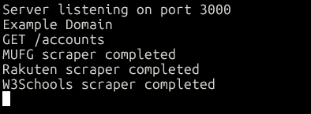
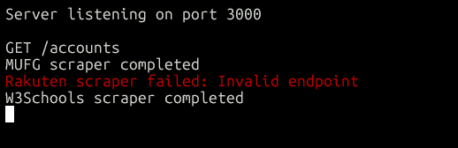
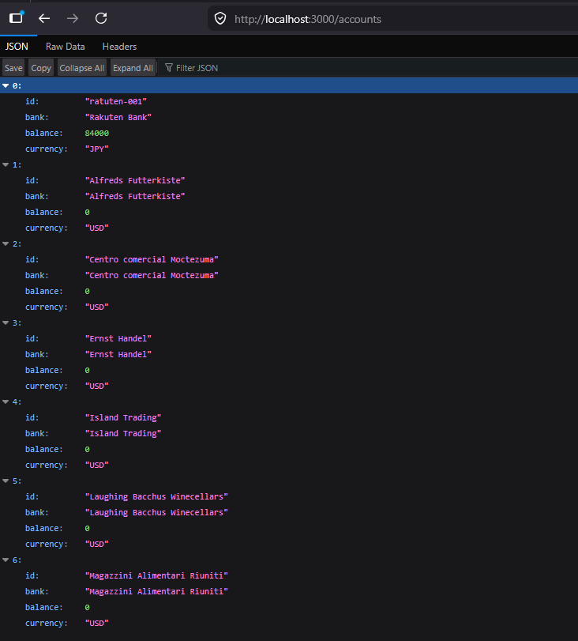

# ScraperEdge

ScraperEdge is a TypeScript-based scraping framework that demonstrates how to build, organize, and orchestrate multiple web scrapers behind a clean API.

Each scraper returns normalized data regardless of its source, allowing the application to aggregate results from multiple websites through a single endpoint. The project emphasizes type safety, modular architecture, asynchronous programming, and browser automation with Playwright.

The project currently includes placeholder banking scrapers alongside a Playwright-powered demonstration scraper that extracts live tabular data from W3Schools.

## Demo

### Successful Execution


### Partial Failure Handling


### JSON Response


## Features

* Modular scraper architecture with a centralized scraper registry
* Type-safe scraper interface shared across all implementations
* Concurrent execution of multiple scrapers using `Promise.allSettled()`
* Handling of partial failures without interrupting successful scrapers
* Normalized account model independent of the data source
* Playwright-powered browser automation and data extraction
* REST API built with Express
* Dependency injection for improved modularity and testability
* Unit and route testing with Vitest and Supertest
* Clear server-side logging with scraper-specific error reporting
* Extensible design for adding new scrapers with minimal changes

## Architecture

```text
                 GET /accounts
                       │
                       ▼
               Accounts route
                       │
                       ▼
               Account Service
                       │
                       ▼
             Scraper Registry
      ┌────────────┼────────────┐
      ▼            ▼            ▼
    MUFG       Rakuten     W3Schools
      │            │            │
      └────────────┼────────────┘
                   ▼
      Normalized Account Objects
                   │
                   ▼
              JSON Response
```
## Tech Stack

* **Language:** TypeScript
* **Runtime:** Node.js
* **Framework:** Express
* **Browser Automation:** Playwright
* **Package Manager:** npm
* **Module System:** ES Modules

## Installation

Clone the repository:

```bash
git clone https://github.com/LhordeS/ScraperEdge.git
cd ScraperEdge
```

Install dependencies:

```bash
npm install
```

Start the development server:

```bash
npm run dev
```

The server will be available at:

```text
http://localhost:3000
```

### API Endpoints

| Method | Endpoint    | Description                                                      |
| ------ | ----------- | ---------------------------------------------------------------- |
| GET    | `/health`   | Health check endpoint                                            |
| GET    | `/accounts` | Runs all registered scrapers and returns normalized account data |

## Project Structure

```text
src/
├── app.ts
├── server.ts
├── routes/
│   └── scraper.routes.ts
├── scrapers/
│   ├── index.ts
│   ├── mufg.ts
│   ├── rakuten.ts
│   └── w3schools.ts
├── services/
│   └── account.service.ts
└── types/
    ├── account.ts
    └── scraper.ts

tests/
├── account.service.test.ts
├── health.test.ts
└── scraper.routes.test.ts
```

## Testing

The project includes automated tests for both the service and routing layers.

- **Service tests** verify concurrent scraper orchestration, partial failure handling, and account aggregation.
- **Route tests** verify API responses, dependency injection, and error handling using mocked services.

Run the test suite with:

```bash
npm run test:run
```

## Design Decisions

### Common scraper contract

Every scraper implements the same interface so the orchestration layer can execute any scraper without knowing its implementation details.

### Centralized registration

Scrapers are registered in a single location, allowing the application to scale by adding new implementations without modifying the service logic.

### Partial failure tolerance

`Promise.allSettled()` was chosen over `Promise.all()` so that one failing scraper does not prevent successful scrapers from returning data.

### Normalized output

Each scraper converts its source into a common `Account` model, insulating the API from differences between websites.

### Modular architecture

Routing, orchestration, scraper implementations, and shared types are separated to keep responsibilities focused and simplify maintenance.

### Dependency injection

Routes and services receive their dependencies through function parameters rather than hard-coded implementations. This keeps each layer independently testable while preserving a simple production setup.

## Current Limitations

The current implementation uses W3Schools as a public demonstration source. Real-world integrations would require authentication and site-specific scraping logic.
